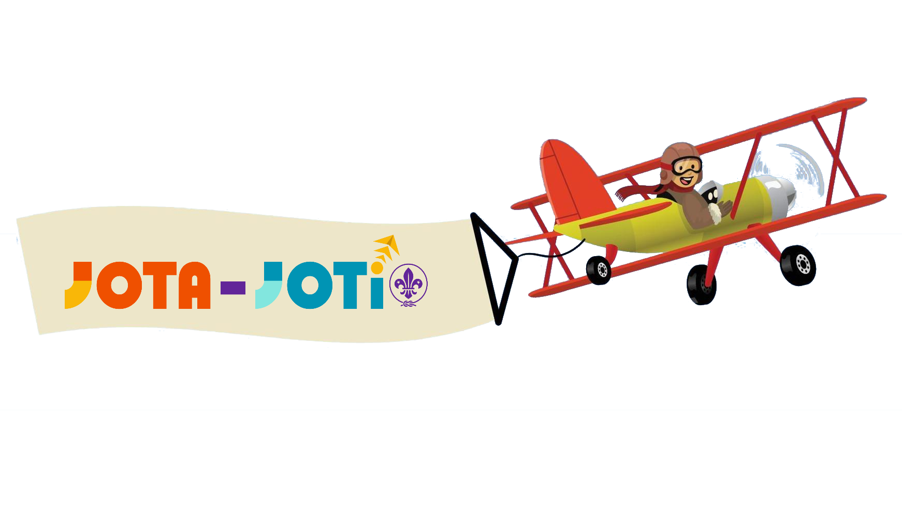
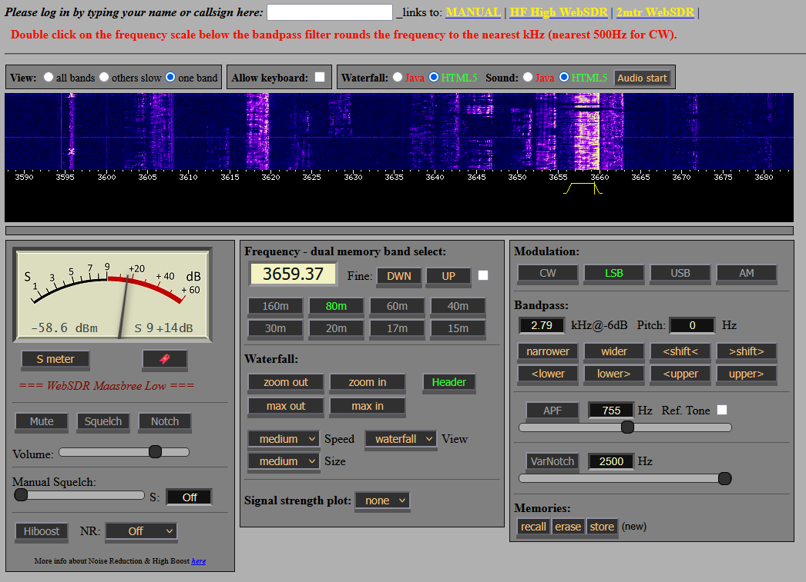
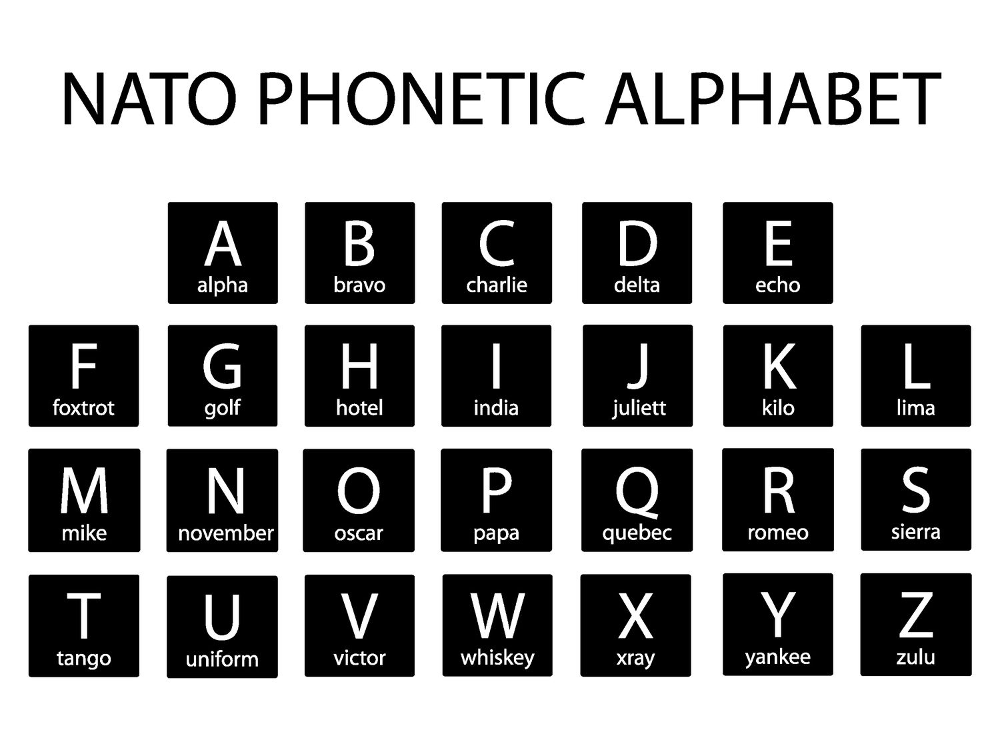

---
hide:
  - navigation
---
# JOTI 2025
## Wat is een Jamboree?
Een **jamboree** is een groot evenement waarbij scouts van over de hele wereld samenkomen. Tijdens een jamboree leer je nieuwe mensen kennen, doe je leuke activiteiten en ontdek je andere culturen. Er zijn verschillende soorten jamborees, zoals de Wereldjamboree, maar ook digitale versies zoals JOTA en JOTI.

- **JOTA** staat voor Jamboree On The Air. Tijdens JOTA communiceren scouts via radioverbindingen. Zendamateurs gebruiken speciale frequenties, zodat je kunt praten met scouts van ver weg — soms zelfs van de andere kant van de wereld.
- **JOTI** betekent Jamboree On The Internet. Hier gebruiken we het internet om contact te maken met scouts over de hele wereld. Via chats, online spelletjes en opdrachten leer je nieuwe vrienden kennen en ontdek je hoe scouting in andere landen werkt.

Dit jaar doet onze scoutinggroep mee aan de JOTI! 🎉  We gaan samen online praten met andere scouts, leuke uitdagingen doen en plezier maken.

## Wat is ScoutLink?
ScoutLink is een speciaal netwerk waar scouts met elkaar kunnen chatten. Het is een veilige plek waar je kunt praten met andere scouts, vragen kunt stellen en samen kunt werken aan verschillende opdrachten. Tijdens JOTI gebruiken wij addIRC om met het ScoutLink-netwerk te verbinden! 

Naast het klassieke addIRC zijn er ook moderne manieren om verbinding te maken met ScoutLink, zoals via apps op je telefoon of tablet. Hierdoor kunnen scouts op verschillende manieren contact met elkaar maken, afhankelijk van wat ze het leukst vinden! Maar jullie gaan addIRC gebruiken omdat dat nu op jullie computers staat geinstaleerd.

## Belangrijke regels!
- **Persoonlijke informatie**: Deel ***nooit*** je volledige naam, adres, telefoonnummer, gebruikersnamen van sociale media of andere persoonlijke informatie in de chat. Dit is belangrijk voor je eigen veiligheid. Gebruik alleen je voornaam of een scoutingnaam.
- **Gedragsregels**: We gebruiken ***geen*** ongepast taalgebruik of en gaan ook ***niet*** spam versturen. Dit kan er voorzorgen dat de hele scouting geblokeerd wordt het ScoutLink-netwerk. Ben dus beschaaft!
- **Vraag om hulp**: Als je ergens niet uitkomt of als iets niet goed werkt, vraag dan meteen de staf om hulp. Ze staan klaar om je te helpen met technische problemen of uitleg over AddIRC.

## Hoe werkt AddIRC?
AddIRC is een programma waarmee je toegang krijgt tot verschillende chatrooms op het ScoutLink-netwerk. Het is de plek waar je andere scouts kunt ontmoeten en samen opdrachten kunt uitvoeren.

- **Verbinding maken met de server**: De staf zorgt ervoor dat AddIRC automatisch verbinding maakt met de ScoutLink-server. Als de verbinding om wat voor reden dan ook wegvalt, roep dan meteen de staf erbij. Zij kunnen de server opnieuw instellen.
- **Chatrooms betreden**: Eenmaal verbonden met ScoutLink kun je verschillende chatrooms betreden. De belangrijkste kanalen zijn **#dutch** voor nederlandstalige chats en **#english** voor internationale chats in het Engels.
- **Privéberichten sturen**: Als je met een specifieke scout apart wilt chatten, kun je op hun naam in de chatroom klikken en hen een persoonlijk bericht sturen. Dit kan handig zijn als je samenwerkt aan een opdracht of vragen hebt.

## Hoe werkt WebSDR?
**WebSDR** zijn websites waarmee je naar **radiosignalen in de lucht** kunt luisteren, zonder dat je zelf een antenne of ontvanger nodig hebt. Ze laten je veel signalen tegelijk bekijken en beluisteren met je computer.

Wat je precies hoort, hangt af van de WebSDR. Meestal laat een WebSDR een **spectrum** zien, van de laagste tot de hoogste frequentie die de SDR kan opvangen.  

Een **frequentie** kun je zien als een adres voor radiogolven: elk station heeft zijn eigen “adres” zodat signalen elkaar niet storen. Technisch gezien is een frequentie **hoe snel een golf op en neer gaat per seconde**. Door die golf te veranderen, kun je er **geluid of data** over sturen, zoals stem, morsepiepjes of digitale tekst. Verschillende signalen gebruiken verschillende coderingen, zoals **AM, FM, CW of digitale modes**, zodat de ontvanger weet hoe hij het moet interpreteren.

Een **WebSDR** is anders dan een gewone radio: een normale radio kan meestal maar **één zender tegelijk horen**, terwijl een WebSDR een **groot deel van het radiospectrum tegelijk opvangt**.  

Op het scherm van een WebSDR zie je waar signalen zitten, meestal als **piekjes of lijnen**, en je kunt zelf kiezen welke frequentie je wilt beluisteren.

Op een WebSDR kun je vaak:

- **Kiezen van frequentie**: klik op een piekje of voer een frequentie in om een specifieke zender te beluisteren.  
- **Volume regelen**: harder of zachter luisteren, net als bij een gewone radio.  
- **Filter instellen / bandbreedte aanpassen**: storingen weghalen of juist een breder signaal horen.  
- **Mode kiezen**: hier vertel je de SDR welk type signaal je wilt horen, bijvoorbeeld:  
    - **AM (Amplitude Modulation)** → oude radiosignalen of stem  
    - **FM (Frequency Modulation)** → heldere stem of muziek  
    - **CW (Continuous Wave)** → morsecode, korte en lange piepjes  
    - **LSB (Lower Side Band)** → spraak van zendamateurs, gebruikt vooral op lagere HF-frequenties  
    - **USB (Upper Side Band)** → spraak van zendamateurs op hogere HF-frequenties  

Een WebSDR is dus een beetje een **super-radio**: je ziet alles wat er in de lucht gebeurt en kunt zelf bepalen **wat je wilt horen en bekijken**.

Voor een **lijst met WebSDR’s over de hele wereld**, kun je kijken op [WebSDR.org](http://websdr.org/).

## Opdrachten?
Alle opdrachten voor JOTI staan op deze website, gesorteerd per categorie. Je hebt verschillende soorten opdrachten zoals de vragenlijst, de Wikipedia-zoektocht, en de communicatie-uitdagingen. Probeer samen met andere scouts via de chatrooms de opdrachten zo goed mogelijk te voltooien. Het team dat de meeste punten verzamelt, wint!

Veel succes en plezier met het ontmoeten van scouts van over de hele wereld tijdens JOTI! Maak nieuwe vrienden, leer nieuwe dingen en vooral: geniet van deze geweldige ervaring! 🌍✨

### Opdracht: Meeluisteren...
| Band           | SSB (Phone)       | CW (Morse)     |
|----------------|-----------------|----------------|
| 80 meter-band  | 3.690 & 3.940 MHz | 3.570 MHz      |
| 40 meter-band  | 7.090 & 7.190 MHz | 7.030 MHz      |
| 20 meter-band  | 14.290 MHz        | 14.060 MHz     |
| 17 meter-band  | 18.140 MHz        | 18.080 MHz     |
| 15 meter-band  | 21.360 MHz        | 21.140 MHz     |
| 12 meter-band  | 24.960 MHz        | 24.910 MHz     |
| 10 meter-band  | 28.390 MHz        | 28.180 MHz     |
| 6 meter-band   | 50.160 MHz        | 50.160 MHz     |

De tabel laat de richtlijnfrequenties zien die Scouts tijdens JOTA gebruiken. Elke band heeft zijn eigen eigenschappen: lage banden zoals 80 en 40 meter reiken verder ‘s nachts, terwijl hogere banden zoals 20 tot 10 meter beter overdag werken. De SSB-frequenties zijn bedoeld voor spraakcommunicatie en de CW-frequenties voor Morsecode.

Tijdens JOTA kun je je radio op een van de frequenties uit de tabel zetten en meeluisteren met andere stations. Elke zendamteur gebruikt een call sign om zich te identificeren. Bij het doorgeven van call signs wordt vaak het NATO-spellingsalfabet gebruikt, bijvoorbeeld “A als Alfa, B als Bravo, C als Charlie”, zodat letters altijd duidelijk zijn en er geen misverstanden ontstaan. 

**Beantwoord:** Beantwoord de vragen om jou kennis van JOTA te testen. 

1. **Wat is het verschil tussen SSB (Phone) en CW (Morse) communicatie?**
2. **Welke banden werken het beste ‘s nachts en welke overdag?**
3. **Waarom gebruikt men het NATO-spellingsalfabet bij het doorgeven van call signs?**
4. **Wat is een call sign en waarom is het belangrijk tijdens JOTA?**
5. **Noem één voorbeeld van een frequentie waarop je spraakcommunicatie (SSB) kunt luisteren en één waarop je Morsecode (CW) kunt horen.**

**Opdracht:** Vind mogelijk callsigns en frequenties waarop jij andere scouts hebt gehoord. 

### Opdracht: Internationale vragen?
Zoek een scout uit een land waarmee je wilt chatten. Vraag aan deze scout bij welke scouting hij zit en van welk land hij is. Hoe verder weg deze scout zich van jou bevindt hoe meer punten er beschikbaar komen. Schrijf deze locatie dus `scouting+land` goed op het antwoorden vel. Schrijf ook het antwoord van de vraag op, op het antwoord vel. Vraag dan maximaal 5 vragen aan deze scout. Probeer dus niet zo snel mogelijk door al je vragen heen te zijn want anders kom je zometeen een scout tegen die verder weg is en heb je dus punten laten liggen. 

1. **Wat is de meest populaire scoutingactiviteit in jouw land?**
2. **Wat is een typisch gerecht dat je tijdens scoutingkampen in jouw land eet?**
3. **Wat zijn de grootste uitdagingen waarmee scouts in jouw land te maken hebben?**
4. **Wat is een populaire traditie of festiviteit die scouts in jouw land vieren?**
5. **Hoe verschilt scouting in jouw land van scouting in Nederland?**
6. **Wat zijn de belangrijkste waarden die scouts in jouw land hooghouden?**
7. **Hoeveel scouts zijn er in jouw groep en wat maakt jullie uniek?**
8. **Wat is de grootste scoutingorganisatie in jouw land?**
9. **Welke unieke vaardigheden leren scouts in jouw land?**
10. **Wat is jouw favoriete manier om tijd in de natuur door te brengen als scout?**
11. **Wat zijn populaire buitenactiviteiten in jouw land die scouts vaak doen?**
12. **Hoe belangrijk is teamwork binnen jouw scoutsgroep?**
13. **Wat is een typisch scoutinguniform in jouw land?**
14. **Heb je een favoriete scoutingtechniek die je hebt geleerd?**
15. **Hoe vaak gaan jullie op kamp met je scoutsgroep?**
16. **Wat is de mooiste natuurervaring die je hebt gehad tijdens scouting?**
17. **Wat is een lokaal dier dat je vaak tegenkomt tijdens scoutingactiviteiten?**
18. **Welke spellen zijn populair in jouw scoutinggroep?**
19. **Wat zijn de meest gebruikte materialen in jouw scoutingactiviteiten?**
20. **Wat is iets wat je nog wilt leren binnen scouting?**
21. **Hoe heb je van JOTI gehoord en wat is je eerste indruk?**
22. **Wat hoop je te leren van scouts uit andere landen tijdens JOTI?**
23. **Hoe gebruik je technologie om contact te houden met andere scouts?**
24. **Wat vind je het leukste aan het chatten met scouts van over de wereld?**
25. **Heb je al met scouts uit andere landen gechat? Hoe was dat?**
26. **Wat is een activiteit of spel dat je zou willen organiseren tijdens JOTI?**
27. **Welke vaardigheden of kennis wil je delen met scouts uit andere landen?**
28. **Hoe vaak neem je deel aan internationale scoutingevenementen?**
29. **Wat zijn je verwachtingen van JOTI?**
30. **Wat vind je belangrijk in de verbinding met andere scouts via JOTI?**
31. **Hoe heeft JOTI je geholpen om meer over andere culturen te leren?**
32. **Wat zijn de grootste verschillen die je hebt opgemerkt tussen scouting in jouw land en scouting in Nederland?**
33. **Wat is een unieke activiteit die je zou willen delen met andere scouts tijdens JOTI?**
34. **Hoe belangrijk vind je het om verschillende talen te leren als scout?**
35. **Heb je al ideeën voor toekomstige projecten of activiteiten die je wilt doen met andere scouts?**
36. **Wat vind je het leukste aan het idee om wereldwijd vrienden te maken via scouting?**
37. **Heb je ooit iets bijzonders meegemaakt tijdens een online scoutingactiviteit?**
38. **Wat zou je andere scouts adviseren om het meeste uit JOTI te halen?**
39. **Wat is een typisch spel of activiteit die je graag tijdens JOTI zou willen spelen?**
40. **Wat is een belangrijk doel dat je wilt bereiken tijdens JOTI?**

### Opdracht: Wikipedia zoektocht?
Zoek de antwoorden op de vragen over scouting en communicatie op Wikipedia door relevante keywords te gebruiken. Typ een paar sleutelwoorden in de zoekbalk in plaats van de volledige vraag om een breder overzicht te krijgen. Lees de artikelen aandachtig en noteer de juiste antwoorden op je antwoordenvel. Vergeet niet om interessante feiten of extra informatie te verzamelen, want dat levert bonus punten op. Noteer altijd de naam van het Wikipedia-artikel, de paragraaf waarin je het antwoord hebt gevonden en het antwoord zelf.
Neem de tijd voor elke zoekopdracht, zodat je niets mist en misschien kom je zelfs nog iets interessants tegen.

1. **In welk jaar werd de Boy Scouts of America opgericht?**
2. **Wat is de betekenis van het woord "scouting"?**
3. **Wanneer werd de eerste World Scout Jamboree gehouden?**
4. **Wie is de oprichter van de wereldwijde scoutingbeweging, en wat was zijn bijdrage?**
5. **Wat komt er na `Sta paraat` in de afscheidsbrief van de oprichter van de scoutingbeweging?**
6. **Aan wat is de oprichter van scouting gestorven?**
7. **In welk jaar werd Morse-code ontwikkeld en door wie?**
8. **Wie is de uitvinder van de radio?**
9. **Wie heeft het eerste radiosignaal verzonden?**
10. **Wat is de rol van semaforen in de communicatie?**
11. **Wat is het doel van de Wereldscoutorganisatie (WOSM)?**
12. **In welk jaar werd de eerste editie van het handboek voor scouts gepubliceerd?**
13. **Wat zijn de kleuren van het scoutskostuum in Nederland?**
14. **In welk jaar vond de eerste Jamboree On The Internet (JOTI) plaats?**
15. **Wie heeft het scoutsgroet geïntroduceerd?**
16. **Wat is het doel van de Wereldscoutdag?**
17. **Hoe hete de eerste satelliet en wanneer werd deze gelanceerd?**
18. **Wat zijn de belangrijkste waarden van scouting?**
19. **In welk jaar werd de Internationale Federatie van Scoutingorganisaties (WAGGGS) opgericht?**
20. **Wie zijn enkele bekende scouts in de geschiedenis?**
21. **Wie zijn de oprichters van de eerste scoutsorganisatie in jouw land?**
22. **Wat is de rol van communicatie in noodsituaties?**
23. **In welk jaar werd het internet openbaar toegankelijk?**
24. **Wie was de eerste persoon die een mobiele telefoon uitvond?**
25. **Wat zijn enkele technieken die scouts gebruiken voor navigatie?**
26. **Wie is de huidige leider van de Wereldscoutorganisatie?**
27. **In welk jaar werd de eerste videogameconsole gelanceerd?**
28. **Wie was de uitvinder van de semafoorcommunicatie?**
29. **Wat is de betekenis van de term "outdoor education" in scouting?**
30. **In welk jaar werd de eerste versie van het internetprotocol (TCP/IP) geïmplementeerd?**
31. **Wie zijn de belangrijkste oprichters van scoutingorganisaties wereldwijd?**
32. **Wat zijn enkele communicatietools die scouts gebruiken tijdens JOTI?**
33. **In welk jaar werd de eerste postduif gebruikt voor communicatie?**
34. **Wie heeft de eerste succesvolle communicatiesatelliet ontworpen?**
35. **Wat zijn de verschillende manieren waarop scouts communiceren tijdens een kamp?**
36. **Welke rol speelt sociale media in de communicatie van scoutinggroepen?**
37. **Wat zijn de voordelen van het gebruik van digitale communicatie binnen scouting?**
38. **Hoe beïnvloedt technologie de manier waarop scouts met elkaar communiceren?**
39. **Wat zijn de belangrijkste principes van het Wereldhandvest van Scouting?**
40. **Wat zijn de verschillende speltakken binnen de scouting?**
